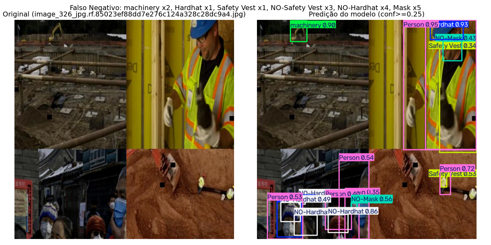
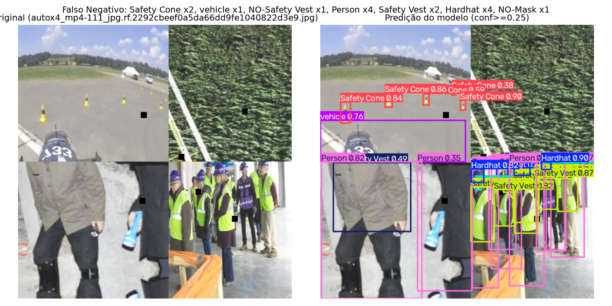
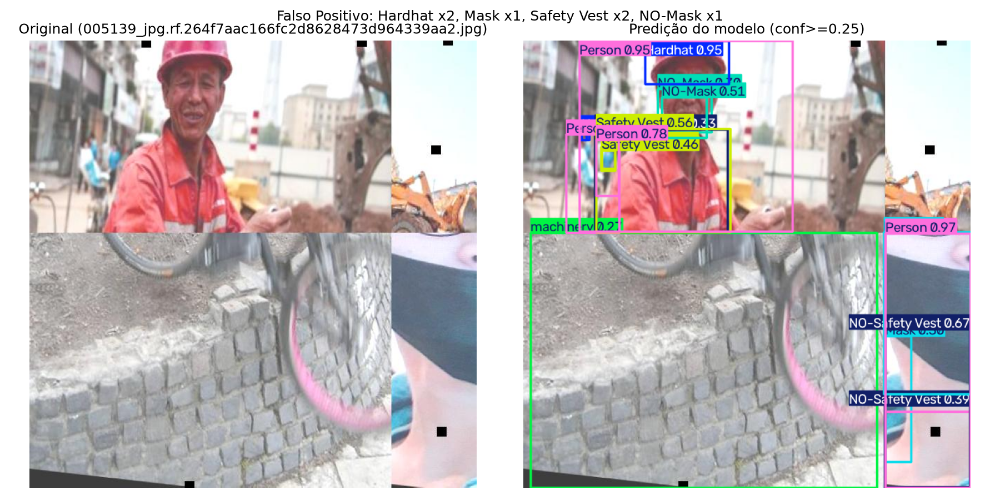
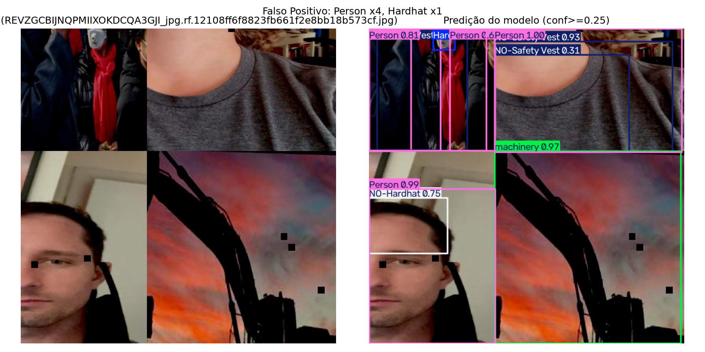

# Avaliação e Vídeo — Fase 4

## Avaliação no conjunto de teste

Métricas calculadas sobre o conjunto de **teste** de cada modelo — imagens nunca vistas em treino ou validação (36 imagens de EPI / 30 imagens de pessoas do COCO).

### Detector (Fase 2 — EPIs)

| Métrica | Valor |
|---|---:|
| Precisão | 0.710 |
| Recall | 0.481 |
| mAP@0.5 | 0.547 |
| mAP@0.5:0.95 | 0.324 |
| **IoU médio (predições casadas, TP)** | **0.793** (n=316 caixas casadas, conf≥0.25, IoU≥0.5) |

Resultado no teste ligeiramente **melhor** que na validação (mAP@0.5 = 0.547 vs. 0.490) — dentro do esperado para um conjunto de teste pequeno (36 imagens), onde a composição específica das imagens pode favorecer ou prejudicar levemente as métricas por acaso amostral.

**Matriz de confusão:** `reports/test-evaluation/detection_test/confusion_matrix.png` (e versão normalizada). Principais confusões observadas: `NO-Hardhat` ↔ `Hardhat` e `NO-Mask` ↔ `Mask` — esperado, já que essas classes descrevem o mesmo objeto (capacete/máscara) em estados opostos (presente vs. ausente), exigindo que o modelo perceba a ausência, uma tarefa mais difícil que detectar presença.

### Segmentador (Fase 3 — pessoas)

| Métrica | Caixa | Máscara |
|---|---:|---:|
| Precisão | 0.682 | 0.635 |
| Recall | 0.386 | 0.376 |
| mAP@0.5 | 0.443 | 0.393 |
| mAP@0.5:0.95 | 0.231 | 0.177 |

Resultado no teste **inferior** ao de validação (mask mAP@0.5 = 0.393 vs. 0.559) — o conjunto de teste do COCO-person (30 imagens) é pequeno, e a variação é esperada. `reports/test-evaluation/segmentation_test/confusion_matrix.png` mostra a única classe (`person`) vs. fundo.

## Análise de erros (detector, conjunto de teste)

Exemplos selecionados objetivamente pela maior discrepância de contagem de instâncias por classe entre ground-truth e predição (ver `openspec/specs/test-evaluation` e `design.md` da Fase 4).

### Falso Negativo 1 — multidão com máscaras não detectada

- **Erro:** 5 instâncias de `Mask` não detectadas (entre outras), na cena de multidão no quadrante inferior-esquerdo (imagem-mosaico).
- **Causa provável:** rostos muito pequenos e densamente agrupados (multidão urbana ao fundo) — objetos pequenos combinados com alta densidade são historicamente difíceis para detectores de uma passada (single-shot) como o YOLO, especialmente com poucas épocas de treino (30) e um dataset pequeno.

### Falso Negativo 2 — pessoas ao fundo de um grupo não contadas

- **Erro:** 4 instâncias de `Person` e 4 de `Hardhat` não detectadas, no grupo de pessoas do quadrante inferior-direito.
- **Causa provável:** pessoas parcialmente sobrepostas/ocluídas umas pelas outras em um grupo compacto — oclusão parcial reduz a área visível de cada instância, dificultando tanto a detecção quanto a supressão correta de caixas sobrepostas (NMS).

### Falso Positivo 1 — caixas duplicadas e classe de fundo confundida com `machinery`

- **Erro:** múltiplas caixas sobrepostas para a mesma pessoa (`Person`, `Safety Vest`, `NO-Mask` duplicados) e uma caixa grande de `machinery` sobre uma parede de pedras (sem máquina real).
- **Causa provável:** (1) supressão de não-máximos (NMS) não eliminou completamente caixas redundantes para o mesmo objeto — comum quando o modelo tem baixa confiança/pouco treino; (2) textura de pedra irregular pode ter padrões visuais (bordas, sombras) parecidos com peças de maquinário na representação aprendida pelo modelo, gerando falso positivo de classe.

### Falso Positivo 2 — múltiplas pessoas contadas onde há sobreposição

- **Erro:** 4 instâncias extras de `Person` detectadas.
- **Causa provável:** cena com múltiplas pessoas próximas/parcialmente sobrepostas — o modelo tende a gerar caixas extras nessas regiões de alta densidade, o mesmo padrão observado no Falso Negativo 2 (a fronteira entre "objeto real" e "falso positivo por duplicação" é sensível a threshold de confiança e NMS).

### Padrão geral observado

Três dos quatro erros analisados envolvem **cenas com múltiplas pessoas próximas/sobrepostas ou objetos pequenos e densos** — um padrão consistente de dificuldade do baseline (30 épocas, YOLOv8n, dataset de 350 imagens) em cenas de alta densidade, independente de ser falso positivo ou negativo. Isso é coerente com o desbalanceamento e volume reduzido do dataset (Fase 1) e sugere que mais épocas de treino e/ou mais dados de cenas densas melhorariam esse ponto específico em iterações futuras.

## Inferência em vídeo

Vídeo de entrada: `video/input/video_final_canteiro_obra.mp4` (1280×720, 25fps, 38.3s, fonte: Pexels — ver `video/input/README.md`).

- **Detecção de EPI:** `video/output/deteccao_epi/video_final_canteiro_obra.avi` (957 frames, 38.28s, confere com o vídeo de entrada) — caixas de EPI sobrepostas em cada quadro. Em um quadro de verificação (dois trabalhadores empurrando um carrinho de mão), o modelo identificou corretamente `Person` para ambos e `NO-Safety Vest` para os dois — nenhum estava usando colete, e o modelo acertou.
- **Segmentação de pessoas:** `video/output/segmentacao_pessoas/video_final_canteiro_obra.avi` (mesma duração) — máscaras de pessoa sobrepostas em cada quadro. No mesmo instante, o segmentador detectou e mascarou corretamente a silhueta de **um** dos dois trabalhadores (o mais próximo, curvado sobre o carrinho) com confiança 0.95, mas **não** detectou o segundo trabalhador (mais distante, capacete amarelo) — consistente com o recall moderado medido no conjunto de teste (0.376 para máscaras) e com a limitação de generalização do segmentador (treinado só no COCO, nunca viu este domínio).

Ambos os vídeos anotados demonstram o sistema funcionando sobre um vídeo real do cenário, cumprindo o requisito mínimo de 30 segundos do enunciado. Os arquivos `.avi` (formato padrão de saída do Ultralytics no Windows) podem ser convertidos para `.mp4` antes da entrega final, se necessário para o vídeo-pitch (Fase 5).
