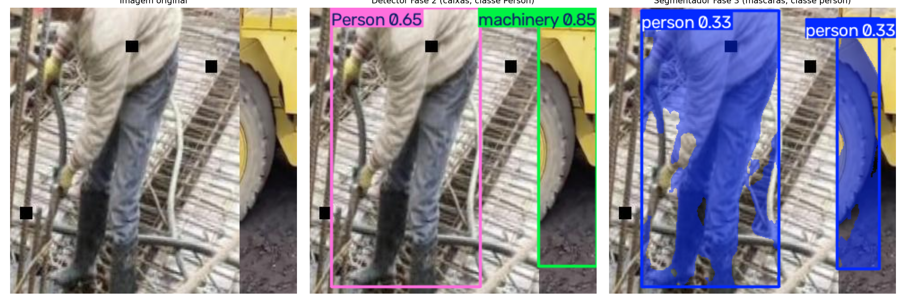

# Segmentação — Baseline (Fase 3)

## Modelo e hiperparâmetros

- **Modelo:** YOLOv8n-seg (Ultralytics), pré-treinado no COCO, fine-tuning para classe única `person`.
- **Dataset:** subconjunto do COCO da Fase 1 (300 imagens, 210 treino / 60 validação / 30 teste), anotações poligonais convertidas para formato YOLO-seg.
- **Ambiente de treino:** CPU local, ~61 minutos para 30 épocas.

| Hiperparâmetro | Valor |
|---|---|
| Épocas | 30 |
| Tamanho de imagem (imgsz) | 640 |
| Batch | 16 |
| Otimizador | `auto` → AdamW (lr0=0.002, momentum=0.9) |
| Seed | 42 |
| Patience (early stopping) | 100 (não acionado) |

**Augmentation:** mesma configuração padrão Ultralytics usada na Fase 2 (`hsv_h=0.015`, `hsv_s=0.7`, `hsv_v=0.4`, `translate=0.1`, `scale=0.5`, `fliplr=0.5`, `mosaic=1.0`, `auto_augment=randaugment`, `erasing=0.4`; sem rotação/shear/perspective/mixup/copy_paste).

## Métricas de validação (época 30, `best.pt`)

| Métrica | Caixa (Box) | Máscara (Mask) |
|---|---:|---:|
| Precisão | 0.738 | 0.697 |
| Recall | 0.509 | 0.507 |
| mAP@0.5 | 0.561 | 0.559 |
| mAP@0.5:0.95 | 0.333 | 0.288 |

Resultado superior ao baseline de detecção da Fase 2 (mAP@0.5 = 0.490) — esperado, já que é uma tarefa de classe única (`person`) sobre um dataset (COCO) mais próximo da distribuição original de pré-treino do modelo, enquanto a Fase 2 lida com 10 classes específicas de domínio (EPIs) menos representadas no pré-treino.

## Comparação visual: caixas × máscaras

Rodamos o detector da Fase 2 (10 classes, incluindo `Person`) e o segmentador desta fase (classe `person`) sobre as **mesmas imagens** do dataset de canteiro de obra (fora do domínio de treino do segmentador, que só viu COCO).

**Nota sobre o dataset de origem:** ao preparar os exemplos, identificamos que uma parcela relevante das imagens do Construction Site Safety (versão exportada usada na Fase 2) são, na verdade, **mosaicos 2×2** (4 fotos distintas combinadas em uma única imagem) — provavelmente herdados de uma etapa de augmentation "Mosaic" do Roboflow que ficou embutida na exportação. Isso não invalida o treino da Fase 2 (cada quadrante ainda tem objetos e caixas válidas), mas torna as imagens inteiras pouco didáticas para uma comparação visual. Por isso, os exemplos abaixo usam **um recorte de um único quadrante** (contendo uma pessoa), não a imagem mosaico completa.

### Exemplo 1 — pessoa parcialmente visível (pernas), junto a uma máquina

- **Caixa (detector):** um retângulo "Person" que cobre as pernas e parte do fundo (rebar, chão) — a caixa é uma aproximação grosseira, não diz nada sobre a forma real da pessoa.
- **Máscara (segmentador):** segue o contorno real das pernas/calça, inclusive captando os "buracos" onde as hastes de rebar aparecem à frente do corpo (oclusão parcial) — informação que a caixa não representa.
- **Limitação observada:** o segmentador também classificou erroneamente o pneu da máquina como `person` (confiança baixa, 0.33) — um falso positivo plausível dado que o modelo nunca viu esse domínio (canteiro de obra) no treino, só COCO.

### Exemplo 2 — pessoa com capacete, vista de baixo

- **Caixa (detector):** múltiplas caixas específicas de EPI (`Hardhat 0.84`, `NO-Mask 0.33`) além de `Person` — informação rica sobre *equipamento*, mas cada caixa é um retângulo que não acompanha a forma da cabeça/capacete.
- **Máscara (segmentador):** uma única máscara `person` que acompanha o contorno arredondado da cabeça e do capacete, mas não distingue "tem capacete" de "não tem" — o segmentador não sabe nada sobre EPI, só sobre a silhueta da pessoa.

### Conclusão da comparação

Os dois modelos são complementares: o **detector** (Fase 2) informa *o quê* está presente (EPI usado ou não, por classe), enquanto o **segmentador** (Fase 3) informa *a forma exata* da pessoa (silhueta, contorno, oclusão) — mas não sabe nada sobre equipamento. Um sistema completo de auditoria de segurança se beneficiaria de combinar as duas saídas (ex.: usar a máscara da pessoa para recortar a região de interesse e aplicar o detector de EPI só ali).

## Artefatos

- Pesos: `models/segmentation/coco_person_yolov8n_seg_baseline/weights/best.pt` e `last.pt` (não versionados)
- Curvas de treino: `results.png`, `results.csv`
- Curvas de precisão/recall (caixa e máscara): `BoxPR_curve.png`, `MaskPR_curve.png`, etc.
- Comparação visual: `reports/figures/boxes_vs_masks_example_1.png`, `boxes_vs_masks_example_2.png`
